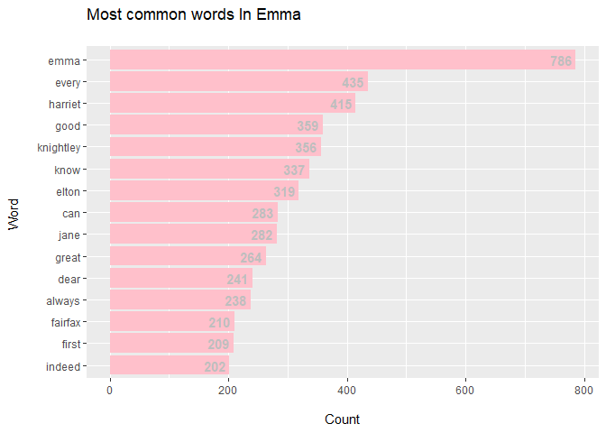
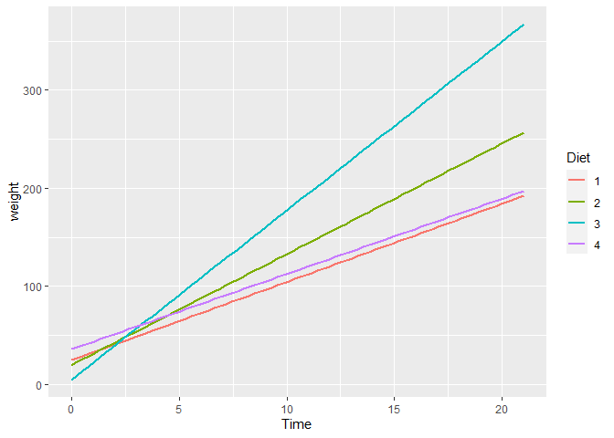

Strings and Functional Programming
================
Christina Sun
12/10/2021

``` r
suppressPackageStartupMessages(library(janeaustenr))
```

    ## Warning: package 'janeaustenr' was built under R version 4.1.2

``` r
suppressPackageStartupMessages(library(tidytext))
```

    ## Warning: package 'tidytext' was built under R version 4.1.2

``` r
suppressPackageStartupMessages(library(tidyverse))
suppressPackageStartupMessages(library(stopwords))
```

    ## Warning: package 'stopwords' was built under R version 4.1.2

``` r
suppressPackageStartupMessages(library(ggplot2))
suppressPackageStartupMessages(library(qdap))
```

    ## Warning: package 'qdap' was built under R version 4.1.2

    ## Warning: package 'qdapRegex' was built under R version 4.1.2

    ## Warning: package 'qdapTools' was built under R version 4.1.2

``` r
suppressPackageStartupMessages(library(tm))
```

    ## Warning: package 'tm' was built under R version 4.1.2

``` r
suppressPackageStartupMessages(library(datateachr))
```

# Exercise 1: Freuqency of common words in text

In this exercise, we will be looking at the book *Emma* and calculate
the word frequency of its text.

**Tokenize the words in the text**

We will first convert the text into a data frame. Then we will remove
the stopwords from the text prior to word frequency calculation for the
purpose of calculating only meaningful words. We use the “Snowball”
stopwords list from the R package *stopwords*.

``` r
book_df <- tibble(txt = emma)
stop_words <- data.frame(stopwords::stopwords("en", source = "snowball"))
colnames(stop_words) <- "token"
colnames(book_df) <- "col"
book_df <- book_df %>%
  unnest_tokens(token, col) %>%
  anti_join(stop_words,by = "token")
```

**Calculate the word frequency**

We will then perform calculation of the word frequency occurred in
*Emma*. We first count the number each word occurred, then filter out
the words that showed up less than 200 times, and finally re-order the
word entries in an increasing order.

``` r
frequency_dataframe <- book_df %>% 
  count(token) %>% 
  filter(n>200) %>% 
  mutate(token = reorder(token, n))
```

**Plot the word frequency result**

Finally, we will plot the resulting common word frequency. We observe
from the plot that, unsurprisingly the name “emma” occurred most
frequently; And the other common words are character names such as
“harriet”, “knightley”, or positive words like “good”, “great”, “dear”.
We can conclude that, this book is fully of gossips as well as positive
energy!

``` r
head_df <- head(frequency_dataframe, 15) 
ggplot(head_df, aes(x = token, y = n)) + geom_col(fill = "pink", alpha = 1.4) + coord_flip() + labs(x = "Word \n", y = "\n Count ", title = "Most common words In Emma \n") +
  geom_text(aes(label = n), hjust = 1.2, colour = "grey", fontface = "bold")
```

<!-- -->

# Exercise 3: Fit seperate models

In this part, we will utilize the dataset “ChickWeight” to investigate
the relationship between different diets and growing speed of chickens.

**Create list-column of model objects**

First, we want to pick four chicks with the ID number 1, 25, 35 and 45,
representing the diet type 1, 2, 3 and 4, respectively. We then convert
the four data groups into four linear models, each representing the
corresponding speed of weight growing for each chick.

``` r
head(ChickWeight)
```

    ##   weight Time Chick Diet
    ## 1     42    0     1    1
    ## 2     51    2     1    1
    ## 3     59    4     1    1
    ## 4     64    6     1    1
    ## 5     76    8     1    1
    ## 6     93   10     1    1

``` r
list_column <- ChickWeight %>%
  filter(Chick == 1 | Chick == 25 | Chick == 35 | Chick == 45) %>%
  group_by(Diet) %>%
  nest()

list_model <- list_column %>%
  mutate(model = map(data, ~lm(weight ~ Time, data = .x)))
```

**Evaluate each model**

We then evaluate each linear model based on their coefficient data, such
as estimate, std.error, statistic and p.value. Now we have a new column,
containing one tibble of coefficients for each linear model (i.e. each
chick).

``` r
list_coeff <- list_model %>%
  mutate(coeff = map(model, tidy))
print(list_coeff)
```

    ## # A tibble: 4 x 4
    ## # Groups:   Diet [4]
    ##   Diet  data              model  coeff           
    ##   <fct> <list>            <list> <list>          
    ## 1 1     <tibble [12 x 3]> <lm>   <tibble [2 x 5]>
    ## 2 2     <tibble [12 x 3]> <lm>   <tibble [2 x 5]>
    ## 3 3     <tibble [12 x 3]> <lm>   <tibble [2 x 5]>
    ## 4 4     <tibble [12 x 3]> <lm>   <tibble [2 x 5]>

**Unnest the resulting coefficient calculations**

Then we want to use the unnest() function to take a closer look at the
coefficient tibbles. By doing unnest(), we are able to observe the
coefficients for each linear model showing directly in the resulting
large tibble, instead of seeing abstract small tibbles.

``` r
list_unnest <- list_coeff %>%
  unnest(coeff)
print(list_unnest)
```

    ## # A tibble: 8 x 8
    ## # Groups:   Diet [4]
    ##   Diet  data              model  term      estimate std.error statistic  p.value
    ##   <fct> <list>            <list> <chr>        <dbl>     <dbl>     <dbl>    <dbl>
    ## 1 1     <tibble [12 x 3]> <lm>   (Interce~    24.5      6.73      3.64  4.56e- 3
    ## 2 1     <tibble [12 x 3]> <lm>   Time          7.99     0.524    15.3   2.97e- 8
    ## 3 2     <tibble [12 x 3]> <lm>   (Interce~    19.7      6.22      3.16  1.02e- 2
    ## 4 2     <tibble [12 x 3]> <lm>   Time         11.3      0.484    23.3   4.71e-10
    ## 5 3     <tibble [12 x 3]> <lm>   (Interce~     4.76    10.2       0.466 6.51e- 1
    ## 6 3     <tibble [12 x 3]> <lm>   Time         17.3      0.794    21.7   9.53e-10
    ## 7 4     <tibble [12 x 3]> <lm>   (Interce~    35.7      3.21     11.1   6.01e- 7
    ## 8 4     <tibble [12 x 3]> <lm>   Time          7.69     0.250    30.8   3.10e-11

**Produce plot for each linear model**

Finally, we will produce a plot to present the resulting calculations.
We plot the four linear models, each as a line of different color. We
observe that the chick with Diet 3 provides significantly fast speed of
weight growth, the chick with Diet 2 shows a medium grow speed, and the
chick with Diet 1 & 4 shows similarly slow speed of growing.

``` r
ChickWeight %>%
  filter(Chick == 1 | Chick == 25 | Chick == 35 | Chick == 45) %>%
  ggplot(aes(x=Time, y=weight, colour = Diet)) +
  geom_smooth(method = lm, se = FALSE, fullrange=TRUE, aes(color = Diet))
```

    ## `geom_smooth()` using formula 'y ~ x'

<!-- -->
